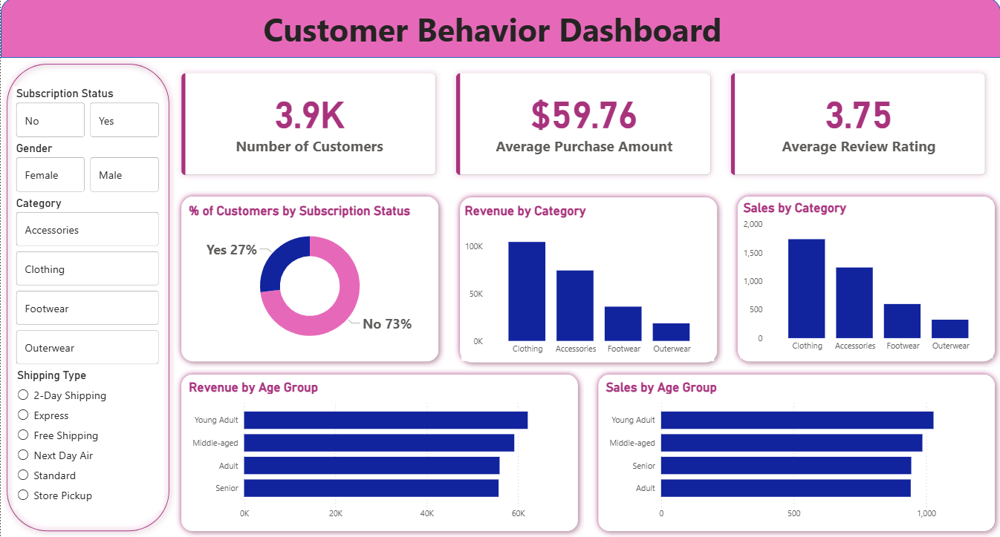

# 🛍️ Customer Shopping Behavior Analysis

## 📌 Overview

This project analyzes customer shopping behavior across 3,900 transactions to uncover insights on spending patterns, product preferences, and customer segmentation using Python, PostgreSQL, and Power BI.

## 🎯 Objective

* Analyze customer purchase behavior
* Identify high-value customers and segments
* Understand product performance and discount impact
* Provide data-driven business insights

## 📊 Key Insights

* Male customers generated significantly higher revenue than female customers
* Discount users still show high spending behavior
* Top-rated products include Gloves, Sandals, and Boots
* Express shipping users spend slightly more than standard users
* 80% of customers fall under the loyal segment
* Young adults contribute the highest revenue

## 📈 Dashboard Features

* KPI Cards (Total Customers, Avg Purchase, Avg Rating)
* Revenue by Category and Age Group
* Subscription Analysis
* Interactive Filters (Gender, Category, Shipping Type)

## 🛠️ Tools Used

* Python (pandas)
* PostgreSQL
* Power BI

## 📂 Files Included

* Customer_Behavior_Dashboard.pbix
* Customer_Behavior_SQL_Queries.sql
* Customer_Shopping_Behavior_Analysis.ipynb
* customer_shopping_behavior.csv

## 📷 Dashboard Preview

## 🚀 Conclusion

This project provides insights to improve customer targeting, optimize discount strategies, and increase overall business revenue.

## 📬 Contact

**Akshaya Vallabhaneni**

* 📧 Email: [akshayavallabhaneni68@gmail.com](mailto:akshayavallabhaneni68@gmail.com)
* 💼 LinkedIn: https://www.linkedin.com/in/akshaya-vallabhaneni-615056320
* 🐙 GitHub: https://github.com/akshayavallabhaneni68-lab
